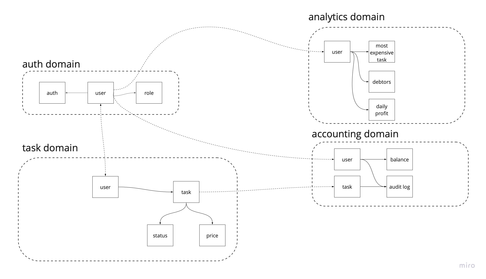

# Домашняя работа за первую неделю (2 и 3 уроки)

# Event Storming

Более подробно и в лучшем качестве можно глянуть в [миро](https://miro.com/app/board/uXjVPRLzxqU=/).

# Модель данных

* user: user auth, user role, user balance
* task: task description, task status, task price
* accounting: auditlog

# Домены

Схема в [miro](https://miro.com/app/board/uXjVPRU99XY=/).

# Сервисы

По итогу выделяем 5 сервисов:
* authenticate - общий сервис авторизации UberPopug Inc;
* task tracker - управление задачами(создание, ассайн, закрытие);
* accounting - произведение расчётов, управление балансами пользователей, ведение аудит лога;
* analytics - формирование аналитическойинформации, полученной из accounting;
* mail - отправка сформированных отчётов;

# Бизнес-события
* user role changed
* task added
* task assigned
* all tasks assigned
* task completed
* task status changed
* task price calculated
* money deposited
* money credited
* money withdrawn

# CUD-события
* create, update, delete users
* daily balance reset
* daily salary calculated
* audit log written
* report sent
